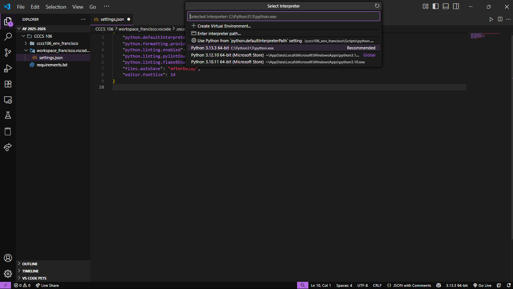
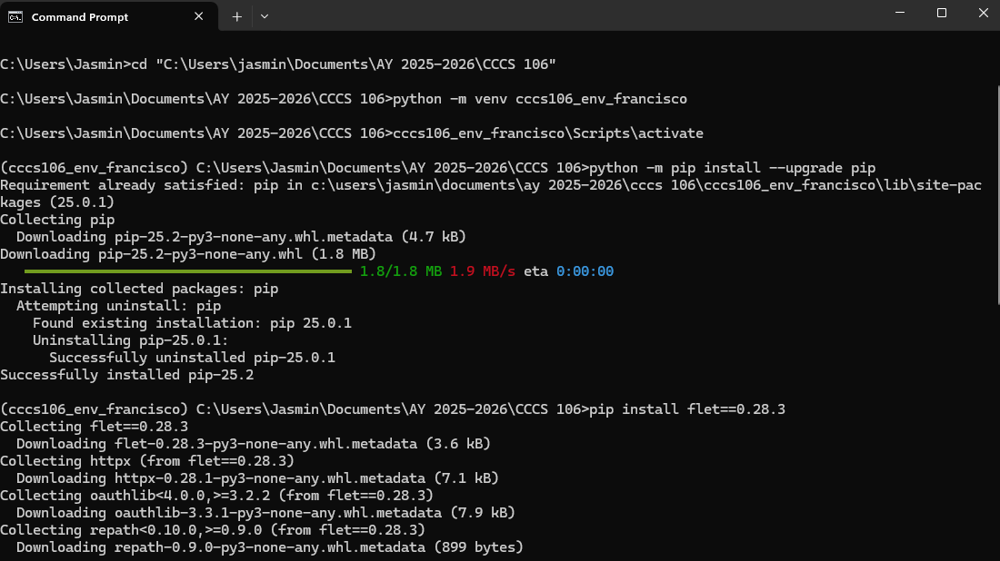
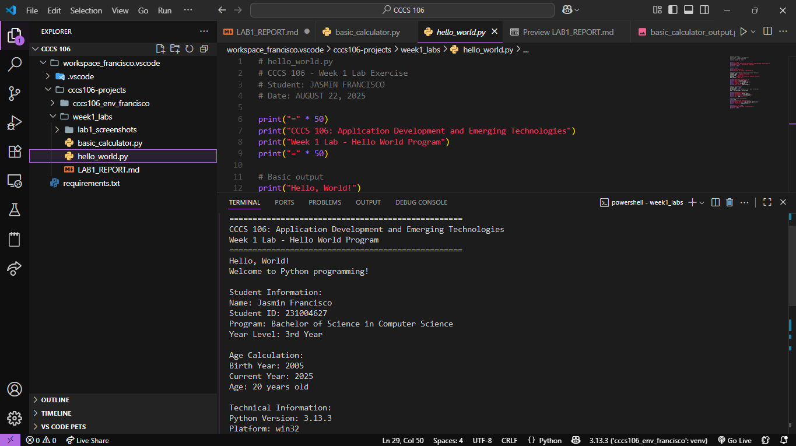
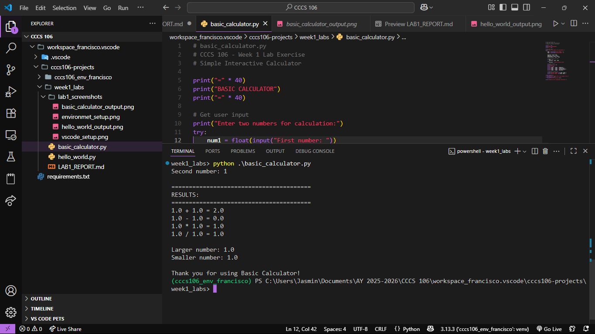

# Lab 1 Report: Environment Setup and Python Basics

**Student Name:** JASMIN B. FRANCISCO\
**Student ID:** 231004627\
**Section:** BSCS 3B\
**Date:** AUGUST 22, 2025

## Environment Setup

### Python Installation
- **Python Version:** Version 3.13
- **Installation Issues:** I didn't encouter any problem since I already have Python in my VSCode
- **Virtual Environment Created:** ✅ cccs106_env_francisco

### VS Code Configuration
- **VS Code Version:** Version: 1.103.2
- **Python Extension:** ✅ Installed and configured
- **Interpreter:** ✅ Set to cccs106_env_francisco/Scripts/python.exe

### Package Installation
- **Flet Version:** 0.28.3
- **Other Packages:** httpx, oauthlib and repath was also installed as collected packages

## Programs Created

### 1. hello_world.py
- **Status:** ✅ Completed
- **Features:** Student info display, age calculation, system info
- **Notes:** I didn't encounter any problem with running the code, yet it made my mind refresh about the basic fundamentals in python programming.
### 2. basic_calculator.py
- **Status:** ✅ Completed
- **Features:** Basic arithmetic, error handling, min/max calculation
- **Notes:** Same with what I encounter and realize in hello_world.py. I observed and realized that I need to learn more especially the basic fundamentals of python.

## Challenges and Solutions

I had trouble with finding the path of my folder, it always says that "The system cannot find the path specified.". What I did is that I created manually a folder then it works.

## Learning Outcomes

This teaches me how to set up the Python environments through using command prompt and it helped me to learn again basic python code.

## Screenshots

