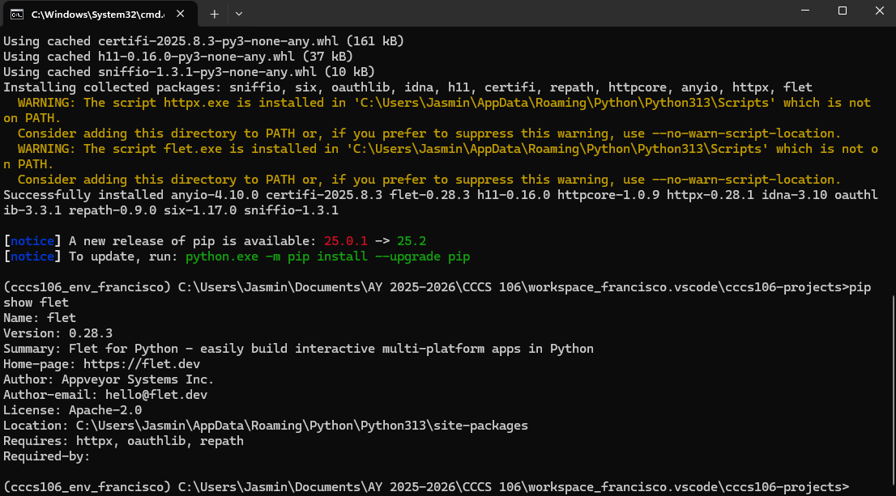
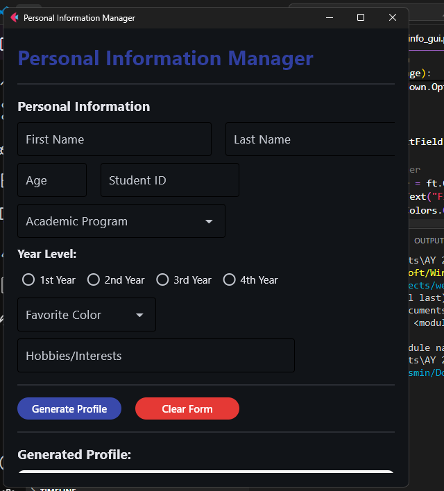
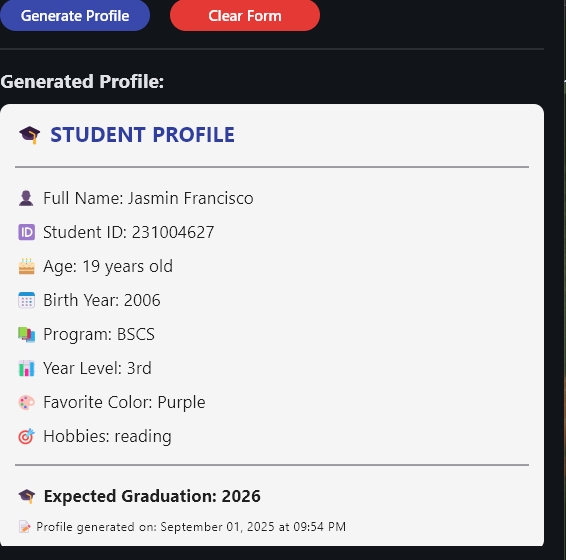
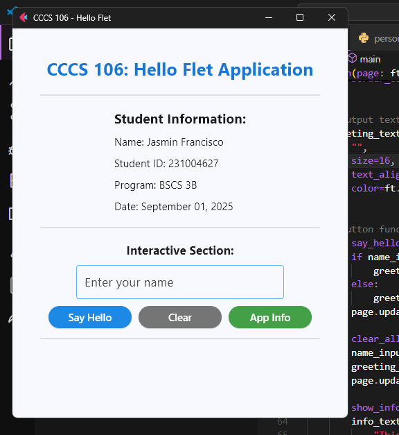
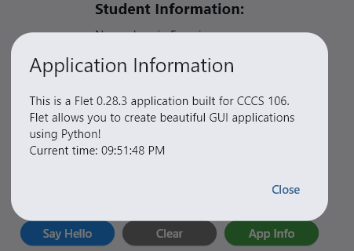

# Lab 2 Report: Git Version Control and Flet GUI Development

**Student Name:** Jasmin Francisco\
**Student ID:** 231004627\
**Section:** BSCS 3B\
**Date:** September 1, 2025

## Git Configuration

### Repository Setup
- **GitHub Repository:** https://github.com/jasscs/cccs106-projects.git
- **Local Repository:** ✅ Initialized and connected
- **Commit History:** 4

### Git Skills Demonstrated
- ✅ Repository initialization and configuration
- ✅ Adding, committing, and pushing changes
- ✅ Branch creation and merging
- ✅ Remote repository management

## Flet GUI Applications

### 1. hello_flet.py
- **Status:** ✅ Completed
- **Features:** Interactive greeting, student info display, dialog boxes
- **UI Components:** Text, TextField, Buttons, Dialog, Containers
- **Notes:** [Any challenges or observations]

### 2. personal_info_gui.py
- **Status:** ✅ Completed
- **Features:** Form inputs, dropdowns, radio buttons, profile generation
- **UI Components:** TextField, Dropdown, RadioGroup, Containers, Scrolling
- **Error Handling:** Input validation and user feedback
- **Notes:** [Any challenges or observations]

## Technical Skills Developed

### Git Version Control
- Understanding of repository concepts
- Basic Git workflow (add, commit, push)
- Branch management and merging
- Remote repository collaboration

### Flet GUI Development
- Flet 0.28.3 syntax and components
- Page configuration and layout management
- Event handling and user interaction
- Modern UI design principles

## Challenges and Solutions

I thought my environment has a problem as it does not have a flet. I just installed (pip install flet) flet at the activated cmd of mine and the code works.
Regarding with the code in personal_info_gui.py, I just changed the color of the font since it is too light and can't be seen. 

## Learning Outcomes

I learned here how to fix some minor issues and to explore. Through exploring Github, it teaches me how to save the codes properly, wherein it'll be a great use and asset in the future.

## Screenshots

### Git Repository
- [/] GitHub repository with commit history
- [/] Local git log showing commits

### GUI Applications
- [/] hello_flet.py running with all features
- [/] personal_info_gui.py with filled form and generated profile

## Future Enhancements

[Ideas for improving the applications or additional features to implement]
